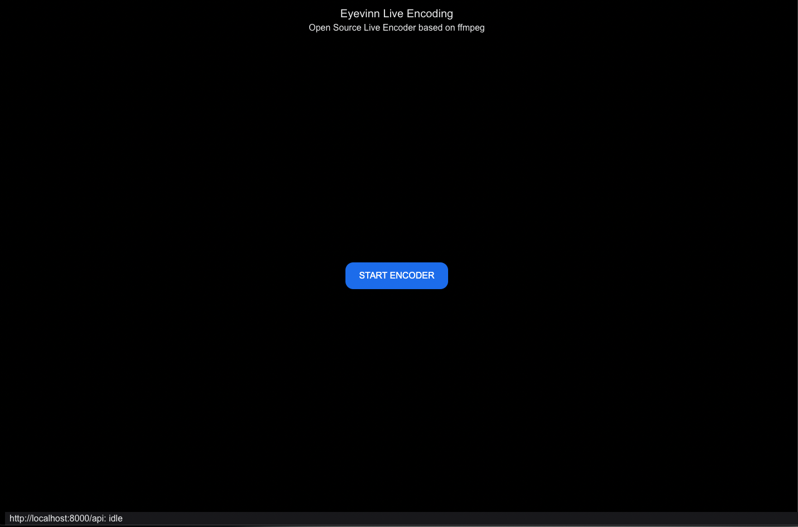
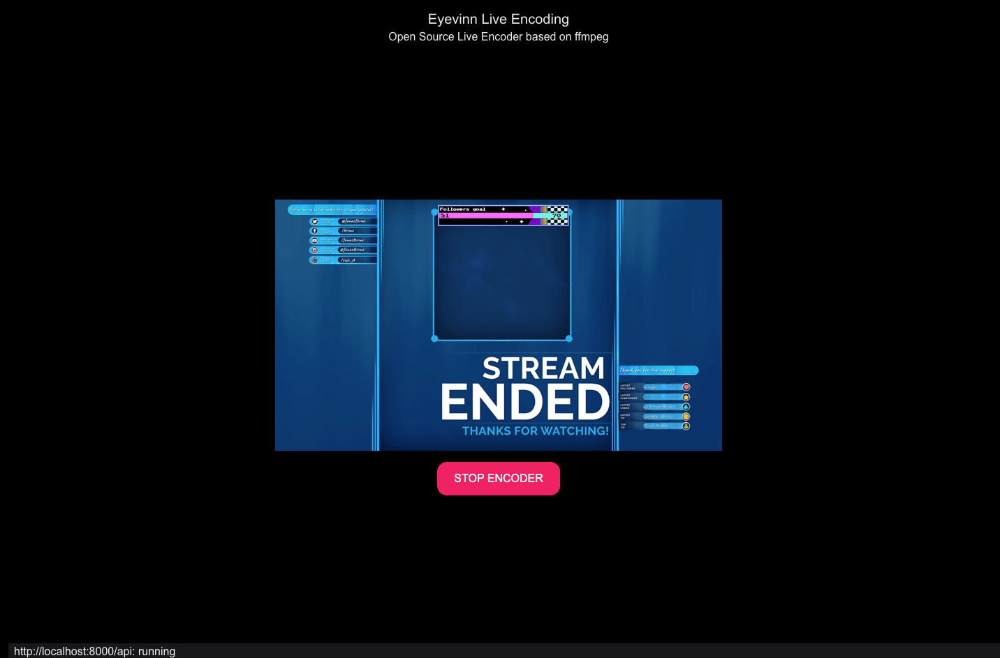

<h1 align="center">
  Eyevinn Live Encoding
</h1>

<div align="center">
  Open Source Live Encoder based on ffmpeg and Shaka packager. 
  <br />
  <br />
  :book: <b><a href="https://docs.osaas.io/">Available as a Service</a></b> :eyes:
  <br />
</div>

<div align="center">
<br />

[](https://github.com/Eyevinn/live-encoding/issues?q=is%3Aissue+is%3Aopen+label%3A%22help+wanted%22)
[](https://github.com/Eyevinn)
[](http://slack.streamingtech.se)

</div>

Live transcoding to HLS and optionally MPEG-DASH. Provides origin for CDN shield to pull streams as well as push to CDN origin.




[](https://app.osaas.io/browse/eyevinn-live-encoding)

## Requirements

- ffmpeg and optionally Shaka packager installed

## Installation / Usage

```
% npm install
```

### Environment Variables

| Variable     | Description                                                                    | Default value |
| ------------ | ------------------------------------------------------------------------------ | ------------- |
| `PORT`       | API port to bind and listen to                                                 | `8000`        |
| `ORIGIN_DIR` |  Location on disk where to write media segments and playlists                  | `/tmp/media`  |
| `HLS_ONLY`   | Only output HLS + TS                                                           | `true`        |
| `RTMP_PORT`  | RTMP port to bind and listen to                                                | `1935`        |
| `STREAM_KEY` | RTMP streamkey                                                                 | `stream`      |
| `OUTPUT_URL` | URL to upload media segments and playlists. If not set push to CDN is disabled |               |

### CDN Pull

Run encoder with media dir at `/data`

```
% ORIGIN_DIR=/data npm start
```

### User Interface

Web user interface available at `http://localhost:8000/`

### API

Start encoder:

```
% curl -X 'POST' \
  'http://localhost:8000/api/encoder' \
  -H 'accept: application/json' \
  -H 'Content-Type: application/json' \
  -d '{
  "timeout": 0
}'
```

Get status:

```
% curl -X 'GET' \
  'http://localhost:8000/api/encoder' \
  -H 'accept: application/json'
```

If status is `starting` you can start pushing to the RTMP address `rtmp://<your-host-ip>:1935/live/stream` (where `stream` is the streamkey).

When status is `running` you can play the HLS from `http://localhost:8000/origin/hls/index.m3u8`

Top stop the encoder:

```
% curl -X 'DELETE' \
  'http://localhost:8000/api/encoder' \
  -H 'accept: application/json'
```

### CDN Push (AWS Media Package)

Run encoder with media dir at `/data`

```
% ORIGIN_DIR=/data \
  OUTPUT_URL=https://<username>>:<password>@xxxxx.mediapackage.xxxx.amazonaws.com/in/v2/e82a0fc53d4b44ec89ac1a1fccd3a333/e82a0fc53d4b44ec89ac1a1fccd3a333/channel \
  npm start
```

### Docker

Run Eyevinn live encoding as a Docker container where `/tmp/media` is a directory on your host.

```
% docker run --rm -d \
  -p 8000:8000 -p 1935:1935 \
  -v /tmp/media:/data \
  eyevinntechnology/live-encoding
```

## Development

Start the API in development mode that restart server if file changes.

```
% DEBUG=1 npm run dev
```

API is then available at http://localhost:8000/api

Start the web application in development mode

```
% npm run dev:app
```

Then the web application is available at http://localhost:3000/ and will connect to the API on port 8000.

To then build the app run:

```
% npm run build:app
```

The output is placed in the folder `out/` that is then served by the server.

## Contributing

See [CONTRIBUTING](CONTRIBUTING.md)

## License

This project is licensed under the MIT License, see [LICENSE](LICENSE).

# Support

Join our [community on Slack](http://slack.streamingtech.se) where you can post any questions regarding any of our open source projects. Eyevinn's consulting business can also offer you:

- Further development of this component
- Customization and integration of this component into your platform
- Support and maintenance agreement

Contact [sales@eyevinn.se](mailto:sales@eyevinn.se) if you are interested.

# About Eyevinn Technology

[Eyevinn Technology](https://www.eyevinntechnology.se) is an independent consultant firm specialized in video and streaming. Independent in a way that we are not commercially tied to any platform or technology vendor. As our way to innovate and push the industry forward we develop proof-of-concepts and tools. The things we learn and the code we write we share with the industry in [blogs](https://dev.to/video) and by open sourcing the code we have written.

Want to know more about Eyevinn and how it is to work here. Contact us at work@eyevinn.se!
